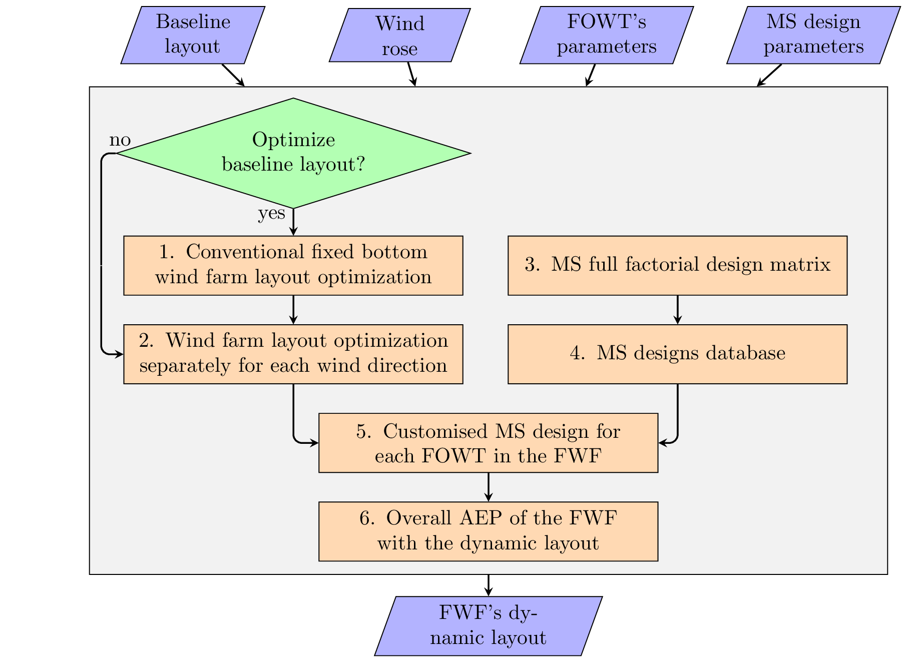

# FloatingWAYS
**Floating** **W**ind **A**rray la**Y**out de**s**ign: a python tool to design passively self-adjusting floating wind array layouts to increase the annual energy production.

## Workflow
The workflow of FloatingWAY is shown in the figure below:

  
  
  
## Dependencies 
- FLORIS v2.4
- MoorPy
- pyOptSparse

Please install these packages before working with FloatWALpy.

## Citation
For citation please cite the following paper

Mahfouz, M. Y. and Cheng, P. W.: A passively self-adjusting floating wind farm layout to increase the annual energy production, Wind
Energy, 26, 251–265, https://doi.org/10.1002/we.2797, 2023.
## License
Copyright 2022 Stuttgart Wind Energy (SWE)

Licensed under the Apache License, Version 2.0 (the "License");
you may not use this file except in compliance with the License.
You may obtain a copy of the License at

http://www.apache.org/licenses/LICENSE-2.0

Unless required by applicable law or agreed to in writing, software
distributed under the License is distributed on an "AS IS" BASIS,
WITHOUT WARRANTIES OR CONDITIONS OF ANY KIND, either express or implied.
See the License for the specific language governing permissions and
limitations under the License.
